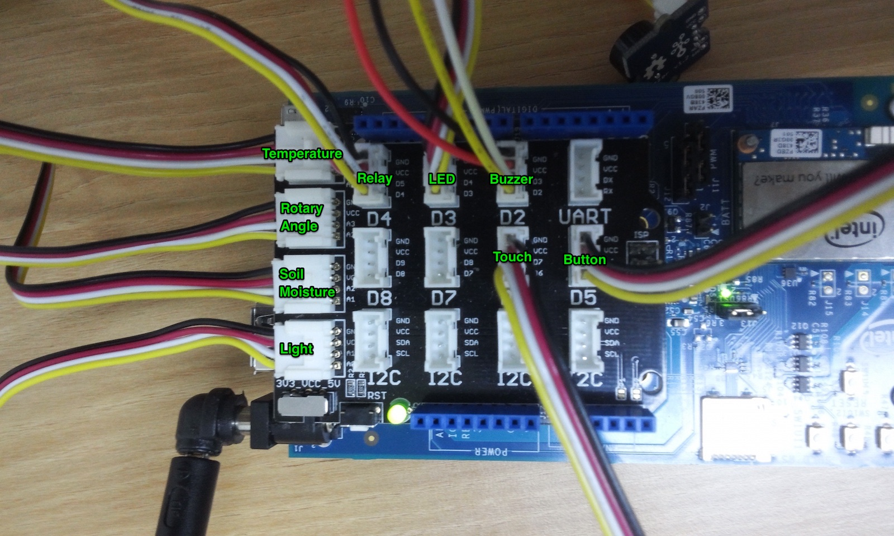

```
COPYRIGHT © SK TELECOM. LTD. All rights reserved.
Powered by Thing+ © 2015 Daliworks Inc.

Reproduction and/or distribution without the written consent of
both SK TELECOM. LTD and Daliworks, Inc. is prohibited.
```

**Version: 0.1.0**


### ThingPlug 연동가이드(Edison Arduino Expansion Board)

#### 1. 환경 설정

1) 아래 홈페이지의 Guide를 따른다.
   - https://software.intel.com/en-us/articles/assemble-intel-edison-on-the-arduino-board

2) Edison에 Grove Base Shield와 센서, power cable을 연결한다.

   

#### 2. 펌웨어 업그레이드

1) 아래 홈페이지에서 사용 OS 별 업그레이드 방법을 따른다.
   - http://www.intel.com/support/edison/sb/CS-035262.htm

#### 3. 설치

1) ipk 파일을 다운로드한다.

```bash
@Edison:$ wget https://raw.githubusercontent.com/SKT-ThingPlug/thingplug-oshw-kit/master/pkg/tp_sktiot_0.5.0_i586_Edison.ipk
```

2) ipk 파일을 설치한다. (반드시 root 계정을 이용해야 한다.)

```bash
@Edison:$ opkg install tp_sktiot_0.5.0_i586_Edison.ipk
```

3) Edison을 재시작한다.

```bash
@Edison:$ reboot
```

#### 4. Edison 등록

1) `Gateway 등록 가이드`를 참고하여 Edison 등록한다.

   - `게이트웨이 모델` 선택 시 `Edison Kit for Arduino`를 선택한다.

   - `디바이스 모델` 선택 시 `Grove Kit`를 선택한다.

   - MAC 어드레스를 얻는 방법은 아래와 같다.

     ```bash
     @Edison:$ cd /opt/tp/scripts
     @Edison:$ ./getmac
     Your MAC address is as below
     xx:xx:xx:xx:xx:xx
     ```

   - 처음 실행 방법은 아래와 같다. 이 때, `API 키`는 앞뒤를 작은 따옴표(')로 감싸야 한다.

     ```bash
     @Edison:$ sudo su
     @Edison:$ cd /opt/tp
     @Edison:$ APIKEY='API 키' ./tp.sh start; ./driver.sh start
     ```

     - 예제

       ```bash
       @Edison:$ sudo su
       @Edison:$ cd /opt/tp
       @Edison:$ APIKEY='A7i3kT9w1-9xWVk447-oJ=' ./tp.sh start; ./driver.sh start
       ```

   - 자동 실행 스크립트에 `./tp.sh start`와 `./driver.sh start`를 추가한다.


--------------------

### 문제 해결 방법

* `센서목록` 페이지에서 등록한 게이트웨이나 센서가 보이지 않을 경우:

  - 등록 절차를 수행하는데 수십 초 정도가 소요되므로, 1분 정도 대기한 후 페이지를 리프레쉬한다
  - 몇 분이 지난 후에도 해당 증상이 계속되면, 터미널에서 Edison에 접속하여 아래 명령을 실행하여 내용을 확인한다.

  ```
  @PC:$ ssh root@<IP Address>
  @Edison:$ cd /opt/tp
  @Edison:$ ./tp.sh restart
  @Edison:$ cd log
  @Edison:$ tail -F -n 300 thingplus.log
  ```

* 한 개 이상의 센서가 등록되지 않았을 경우:

  - 게이트웨이를 재시작하면 자동적으로 미등록 센서를 등록한다.

